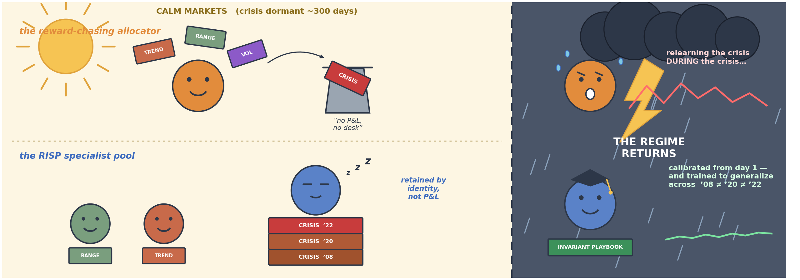
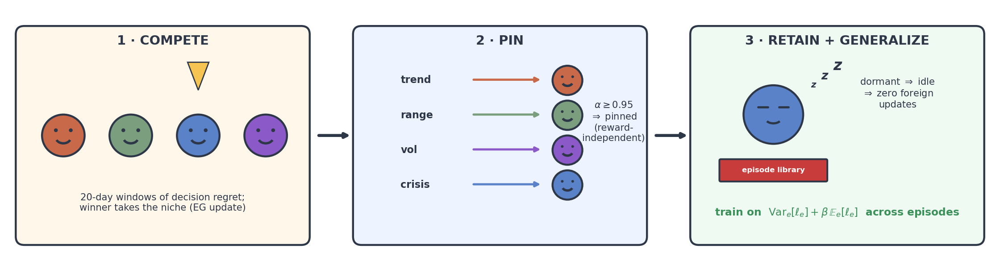
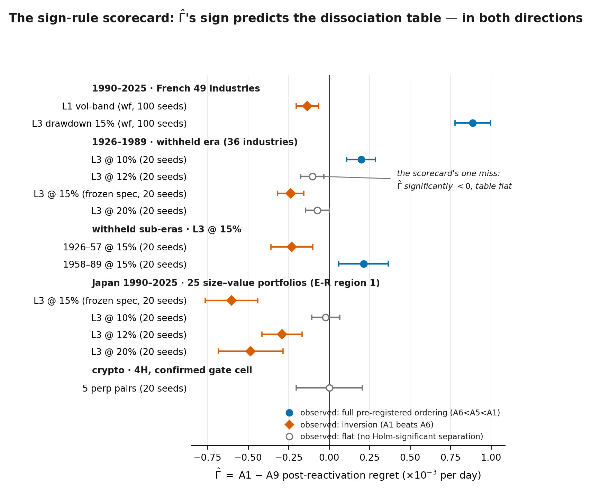
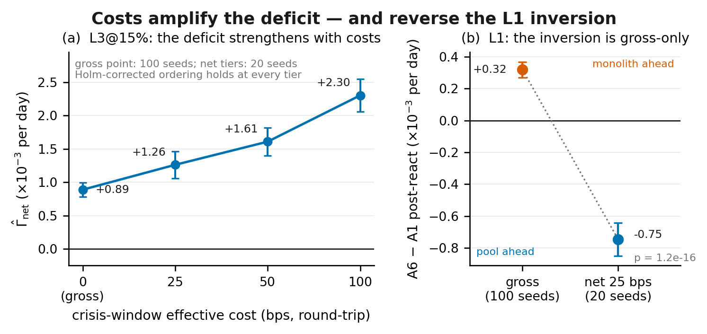
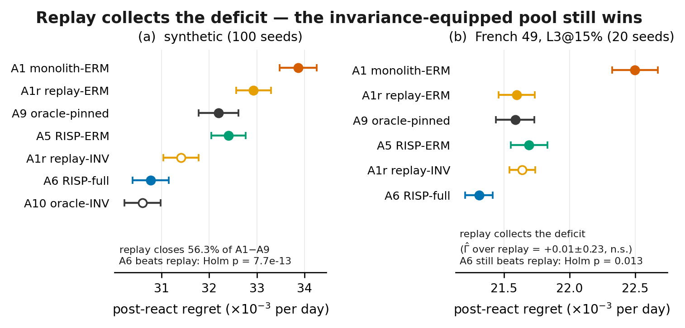
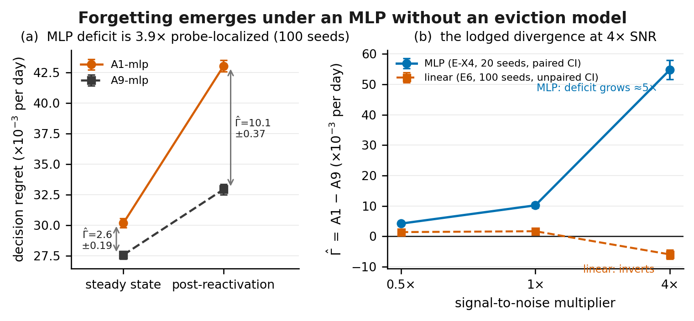
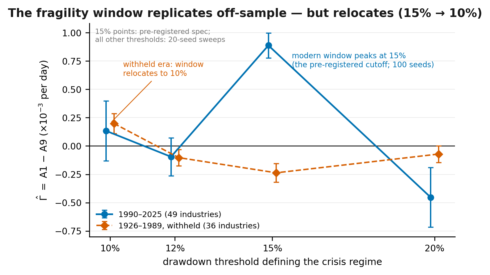
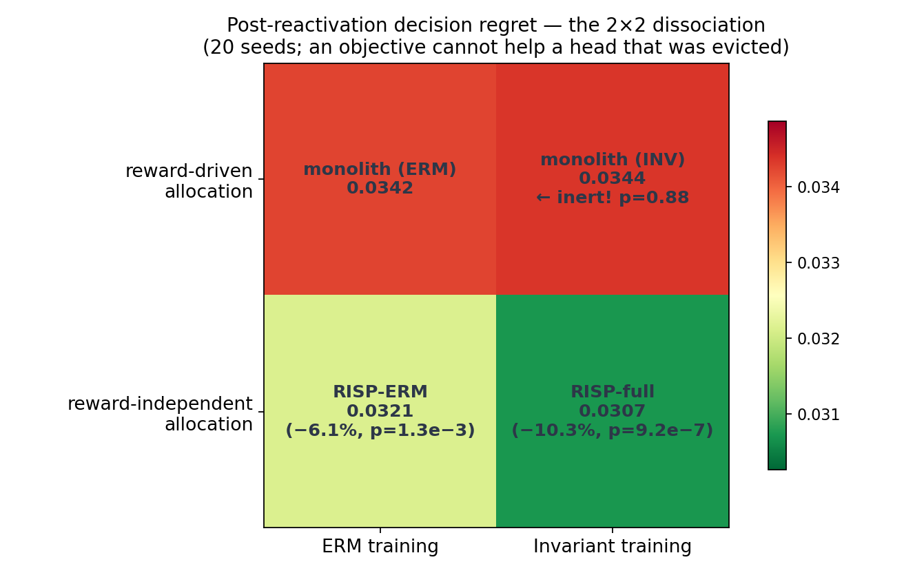
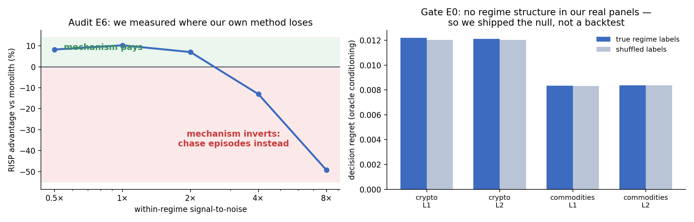

# 🐻‍❄️ RISP: When the Regime Returns

### Regime-Invariant Specialist Pools — Retention and Invariance in Decision-Focused Strategy Pools for Non-Stationary Markets

<div align="center">



<br><br>

[](https://www.python.org/downloads/)
[](LICENSE)
[](#-reproducing-everything)
[](#-reproducing-everything)
[](#-what-did-not-survive-and-why-thats-the-point)

**The crisis specialist should idle through calm markets — and still be right about the *next* crisis, not the last one.**

[Thesis](#-the-thesis-in-one-paragraph) • [Results at a glance](#-results-at-a-glance) • [Honest record](#-what-did-not-survive-and-why-thats-the-point) • [Reproduction](#-reproducing-everything) • [Pre-registration](#-pre-registration) • [Citation](#-citation)

</div>

---

## 📖 The Thesis, in One Paragraph

**RISP** (Regime-Invariant Specialist Pools) is a strategy-pool architecture for decision-focused (predict-then-optimize) learning under regime-switching non-stationarity. Its mechanism has two independent axes, owned by different design knobs: **(N1) an allocation property** — a reward-independent, covering regime→specialist assignment (reached emergently by batched winner-take-all competition, then pinned), because a dormant regime emits no reward to protect itself with; and **(N2) an objective property** — each retained specialist trains across *all* stored episodes of its regime with an episode-variance penalty on a decision-regret surrogate, because retention preserves overfitting too (2008 ≠ 2020 ≠ 2022). On synthetic markets calibrated to realistic signal-to-noise, both axes separate cleanly and super-additively. On real data, the program's working diagnostic is a single paired statistic: **Γ̂ = A1 − A9**, the post-reactivation regret of a capacity-matched monolith minus that of an oracle-pinned pool of ERM specialists. Across twelve scored cells — two markets, two eras (one fully withheld), four crisis definitions, sub-era splits, and four NBER-labeled cells — **the sign of Γ̂ tracks the dissociation table in both directions**: 8/12 under the strong directional form, 12/12 under the one-directional weak form (no dissociation without a significantly positive Γ̂); the four strong-form misses (a marginally significant Γ̂ with a flat arm table, including one conservative withheld-era miss shown in the figure below) are disclosed at full prominence, and the cells are not independent — the record's evidential force is closer to two-to-three effectively independent observations than to twelve. Where the deficit is positive it is real economics — it *strengthens* net of crisis-window transaction costs and survives its most dangerous baseline, a replay-buffer monolith, which collects the deficit but still loses to the invariance-equipped pool. And its honest mechanism on real data is **not** eviction-forgetting: per-event regressions and relearning profiles show a regime-conditional **allocation deficit** (a level offset in how the monolith serves rare regimes), while the eviction-forgetting transient remains a controlled-setting phenomenon that we show also *emerges* — uncoded — under a shared-trunk MLP. Structure screens (gate 1) do not price the pool; Γ̂ does.

<div align="center">
 Pin -> Retain + Generalize" width="95%">
</div>

---

## 📊 Results at a Glance

### The sign-rule scorecard (the program's central real-data result)

<div align="center">

</div>

*One row per scored cell: Γ̂ (monolith − oracle-pinned pool, post-reactivation) with 95% CI. Marker color/shape is the **observed** arm-table outcome under the pre-registered Holm family. Positive Γ̂ rows come out ordering-blue, negative rows inversion-orange, near-zero rows flat — in both directions, on a withheld 64-year era (1926–89) the spec never saw. The one miss (12%: Γ̂ significantly negative, table flat) is annotated, and scored as a miss under the strong directional reading. Walk-forward CIs are seed-noise on a single history; the stitched schedule-resampling design is reported alongside in the JSONs.*

### Costs amplify the deficit — and reverse the inversion

<div align="center">

</div>

*(a) Γ̂ on French-49 L3@15% rises monotonically with crisis-window effective costs (+0.89 gross → +2.30 ×10⁻³/day at 100 bps), with the full ordering Holm-significant at every tier — the reactivated monolith churns the top-5 portfolio hardest exactly when spreads are widest (turnover 1.03/day vs 0.62 for the pool). (b) The L1 inversion — the one case where the monolith beat the pool — flips sign at 25 bps: **the inversion, not the deficit, was the gross-only phenomenon.***

### Replay collects the deficit; the pool still wins

<div align="center">

</div>

*The most dangerous baseline we could build against ourselves: a monolith whose replay buffer survives head eviction, with a generous burst-refit at reactivation. Synthetic: replay closes 56.3% of the A1−A9 deficit — below our own pre-registered 60% bar, so the eviction-coupling mechanism is **stronger** than the theory requires — and still loses to A6 (Holm p = 7.7e-13). French L3: replay collects essentially the whole deficit (data retention ≈ parameter retention against the ERM oracle), yet A6 still beats it (Holm p = 0.013). Retention alone is purchasable; retention + invariance is what wins.*

### Forgetting emerges without being coded

<div align="center">

</div>

*A shared-trunk MLP with a single readout and **no eviction model**: forgetting can only arise as representation interference. It does — Γ̂-mlp = +10.1 ± 0.4 ×10⁻³ at 100 seeds (p = 1.9e-78), and (a) it is ~3.9× concentrated in the post-reactivation probe, i.e. measured interference, not a level artifact. (b) The lodged divergence: at 4× SNR the linear stack inverts (the E6 mechanism) while the MLP deficit grows ~5× — reported at full prominence, with the architectural caveat (single readout vs regime-keyed heads) recorded post-hoc in the JSON. Honest null alongside: the A6-vs-A5 invariance separation does not appear under the MLP (p = 0.13).*

### The window relocates

<div align="center">

</div>

*Γ̂ vs the drawdown threshold that defines the crisis regime, for both eras. The deficit lives in a threshold **window**, not at a point: 1990–2025 peaks at the pre-registered 15% and dies at ±5pp; the withheld 1926–1989 era reproduces the same fragility **pattern** but the window relocates to 10%, tracking that era's much denser crisis inventory. Fragility replicates in form, relocates in position — consistent with a granularity mechanism, fatal to any "15% is special" reading, and disclosed as both.*

---

## 🎯 The Core Idea in 90 Seconds

A multi-strategy fund keeps playbooks for conditions that are mostly absent. The allocation question — *who gets capital and recalibration today, and who keeps a playbook whose regime is dormant?* — has a standard answer (route by recent reward) with a structural flaw: **the regime most needing protection is the one emitting no reward.** When the regime returns, the reward-chaser relearns *during* the crisis — the exact window where decisions are most expensive, and (we now measure) where transaction costs punish churn the hardest.

RISP's two moves:

1. **Retention by identity, not P&L.** Specialists win regimes through competition; once converged, the assignment is pinned and stops responding to reward. The crisis specialist idles through calm markets with its heads and episode library structurally untouchable.
2. **Generalize what you retain.** The retained specialist trains across *all* stored episodes of its regime, penalizing the variance of its decision-regret surrogate across them — keeping the structure all crises share and discarding what only the last one had.

Each move is useless without the other (measured, not asserted: replay buys move 1 at O(buffer) memory and still loses to the pair; invariance inside a reward-driven allocator is inert, p = 0.88 — no loss function can help a head that was evicted during dormancy).

### The synthetic 2×2 (where the axes are provable and separable)

<div align="center">

</div>

| Finding (synthetic, calibrated SNR, 20–100 seeds, Holm-corrected) | Number | p |
|---|---|---|
| Retention axis (RISP-ERM vs capacity-matched monolith) | **−6.1%** | 1.3e−3 |
| Invariance axis (RISP-full vs RISP-ERM) | **−4.4%** | 6.1e−3 |
| Joint (38% of the excess over the irreducible noise floor) | **−10.3%** | 9.2e−7 |
| Invariance inside a reward-driven monolith — **inert** | −0.3% | 0.88 |
| Super-additive interaction (per-seed, 95% CI excludes 0) | −0.0015 ± 0.0005 | — |
| RISP-full vs hand-pinned oracle assignment (same objective) | indistinguishable | 0.72 |
| Replay-decoupled monolith vs A6 (the D1 baseline, 100 seeds) | replay loses | 7.7e−13 |

Boundary sweeps (capacity, dormancy, heterogeneity, SNR, carrying-cost break-even) are unchanged from v1.0 — see `results/` and the papers.

---

## 🔍 What Did NOT Survive (and why that's the point)

This project treats its own claims the way it treats market structure: **gate first, claim second** — and it ships the gate failures at the same prominence as the wins. Every entry below is a pre-registered prediction of ours that reality refused, recorded in [`PREREG_FRENCH49.md`](PREREG_FRENCH49.md) with the registration text frozen above the verdict.

<div align="center">

</div>

1. **The first real-data gate failed — we shipped the null (v1.0).** A pre-registered structure diagnostic (oracle regime-conditioning vs block-shuffled labels, on the decision metric) found no exploitable regime structure in our first real panels (5 crypto pairs, 3 FRED commodities, daily); the 11-arm experiment on stitched crypto is consequently flat (all p > 0.2). The machinery that separates arms at p ~ 1e−6 where structure exists goes flat where it doesn't. *An evaluation that cannot go flat should not be trusted when it goes sharp.*
2. **Our batching story was refuted by our own ablation (v1.0).** We predicted per-step competition would drown in noise; performance is flat across competition windows of 1–60 days. Reported as a revision with the corrected mechanism (EG affinity accumulation does the averaging).
3. **The mechanism inverts where signal is strong (v1.0).** At 4–8× baseline SNR, episode-chasing ERM beats invariant retention by up to 49% — the deployment boundary is a measured crossover, promoted from a failed prototype to an experiment (E6).
4. **The two-gate protocol was refuted in *both* directions — and replaced.** On French-49 L1, both gates said "no dissociation"; the walk-forward delivered a significant *inversion* (P4 triggered). On L3, gate 1 failed by the letter while the full ordering emerged (P7 refuted). The protocol as stated is dead; its successor — **Γ̂'s sign prices the pool; gate 1 is only a structure screen** — was formulated after these results, then committed ex ante and tested on the withheld 1926–1989 era, where it scored 5/6.
5. **Gate 2's lean-PASS predictions were wrong.** Γ̂ came out zero-to-negative on walk-forward L1 French equities (at 100 seeds: small, negative, significant — and the table inverts, as the sign rule prices), flat on the stitched design, and flat on 4H crypto (the confirmed-gate cell, scored in advance: a significant arm separation at Γ̂ ≈ 0 there would have refuted the sign rule a third time; it came out flat-flat, consistent). The first *positive* real-data deficit only appeared with the slow-dormancy L3 drawdown labeler.
6. **P8 threshold robustness: REFUTED.** The 1990–2025 deficit and ordering exist only at the pre-registered 15% cutoff; 10/12% are null and 20% inverts. 15% was fixed before any L3 run, so it is not a tuned peak — but neighborhood robustness is gone, disclosed at headline prominence. The withheld era replicates the fragility *pattern* while relocating the window to 10% (fig 14): evidence for a granularity mechanism over both the "15% is special" and the pure-artifact readings, and we say so with both scorings.
7. **The mechanism was reattributed — "forgetting" was the wrong name on real data.** The pre-registered rehearsal/dormancy regressions (E-X1) found *no* registered covariate explaining the per-event deficit (the ~20% "neither" branch: artifact warning shipped at headline). The relearning-profile probe (E-X3) found a level offset, not a decaying transient — the registered rename applies: on real data the quantity is a **regime-conditional allocation deficit**, not eviction-forgetting. The eviction-forgetting transient is real in the controlled setting (and emerges uncoded under an MLP, E-X4) but is a distinct phenomenon, and the papers now say so.
8. **The E6 inversion does not reproduce under the MLP (lodged divergence).** We predicted (~60%) the high-SNR inversion would reproduce under gradient descent; instead the MLP deficit grows ~5× at 4× SNR. Reported at full prominence with the post-hoc architectural caveat (single readout vs regime-keyed heads — not apples-to-apples). Alongside: the MLP battery's honest null (no A6-vs-A5 invariance separation, p = 0.13) and its win (Γ̂-mlp > 0 at p = 1.9e-78 with **no eviction model in the code** — the "you coded the forgetting in" objection dies).

Two favorable refutations, recorded with the same discipline: replay closed *less* of the deficit than our 60% bar (eviction-coupling stronger than the theory requires), and the overall net-of-costs margin we pre-declared "expected NOT to survive" survived and strengthened ~10×.

---

## 🚀 Quick Start

```bash
git clone https://github.com/HowardLiYH/RISP.git
cd RISP
pip install numpy scipy pandas matplotlib   # that's the whole stack — no GPU

cd code
# v1.0 synthetic battery + gates (each writes results/*.json)
python run_experiments.py e1 --seeds 20    # headline 2x2 (11 arms)
python run_experiments.py e0               # real-data structure gate
python run_experiments.py e2               # capacity sweep (hard + soft memory)
python run_experiments.py e3               # dormancy sweep / break-even
python run_experiments.py e4               # episode-heterogeneity sweep
python run_experiments.py e5               # ablations (beta, W_c, lambda, pinning)
python run_experiments.py e6               # the honest SNR audit

# the French-49 / withheld-era / mechanism wave
python e_french.py                         # gates + dissociation, L1/L2, 1990-2025
python e_french_L3.py                      # the slow-dormancy L3 labeler
python e_french_L3_sweep.py                # threshold sweep 10/12/20%
python e_french_L3_costs.py                # transaction-cost tiers
python e_french_L3_replay.py               # the replay baseline
python e_french_prewar.py                  # withheld era 1926-1989 (+ sub-eras)
python e_x4_mlp.py                         # emergent forgetting (MLP)
python e_x4_mlp.py --expand100             #   ... 100-seed expansion
python e_x4_mlp.py --snr                   #   ... SNR sweep
python e1r_4h.py                           # 4H crypto seed-parity cell

python make_figures.py all                 # paper figures 1-9
python make_figures_v2.py all              # paper figures 10-14 + README PNGs
```

The synthetic battery reruns in under an hour on a laptop; the full French wave is a few hours (CPU only). Every experiment writes a JSON to `results/` (100-seed parity runs to `results_100seed/`, keeping the committed 20-seed provenance intact); every number in the papers traces to one.

---

## 🔁 Reproducing Everything

**Result file → generator map.** All scripts live in `code/`; all seeds are derived deterministically from the seed index (the exact formulas — e.g. schedule `1000+s`, market `5000+s`, arm `99*s+7` on synthetic; arm `1311*s+17` on French walk-forward — are fixed in each script and echoed into each JSON's `config`/`seeding` block).

| Result file(s) | Generator | Notes |
|---|---|---|
| `results/e0_structure_diagnostic.json`, `e6_trigger.json` | `run_experiments.py e0` / `e6t` | v1.0 gate + trigger diagnostic |
| `results/e0_intraday*.json` | `e0_intraday.py`, `e0_intraday_confirm.py` | intraday gate cells |
| `results/e1_synth.json` | `run_experiments.py e1` | 11 arms, 20 seeds |
| `results/e1_replay.json` | `run_experiments.e1(seeds=100, tag="e1_replay", arms=[A1,A5,A6,A9,A10,A1r-erm,A1r-inv])` | PREREG D1 |
| `results/e1s_stitched_crypto.json` | `run_experiments.py e1s` | stitched real crypto (null) |
| `results/e2_*`, `e3_*`, `e4_*`, `e5_*`, `e6_snr_audit.json` | `run_experiments.py e2/e3/e4/e5/e6` | boundary sweeps + SNR audit |
| `results/e1r_4h_crypto.json` | `e1r_4h.py` | 4H seed-parity cell (PREREG D6) |
| `results/e_french49_gate.json`, `e_french49_dissoc.json` | `e_french.py` | L1/L2 gates + ten arms |
| `results/e_french49_L3_gate.json`, `e_french49_L3_dissoc.json` | `e_french_L3.py` | the L3 drawdown labeler |
| `results/e_french49_L3_sweep.json` | `e_french_L3_sweep.py` | thresholds 10/12/20% |
| `results/e_french49_L3_costs.json` | `e_french_L3_costs.py` | cost tiers + L1 slice (PREREG D3) |
| `results/e_french49_L3_replay.json` | `e_french_L3_replay.py` | replay baseline (PREREG D2) |
| `results/e_french49_L3_loro.json` | `e_french_L3_loro.py` | leave-one-reactivation-out |
| `results/e_french49_L3_x1.json` | `e_french_L3_x1.py` | rehearsal regressions (E-X1/X3) |
| `results/e_french49_prewar_L3_*.json` | `e_french_prewar.py` | withheld era: gate, dissoc, sweep, sub-eras, inventory (E-F) |
| `results/e_x4_mlp.json` | `e_x4_mlp.py` (+ `--expand100`, `--snr`) | emergent forgetting (E-X4) |
| `results_100seed/*` | `run_100seed_battery.py`, `run_100seed_rest.py`, `run_100seed_e2_resume.py`, `run_french_100seed.py` | 100-seed parity (PREREG D6) |
| `paper/figures/fig1–9`, `fig10–14` | `make_figures.py`, `make_figures_v2.py` | figures read only JSONs |
| `assets/*.png` (art) | `make_readme_art.py` | README illustrations |

**The audit tool.** Every numeric claim in the paper is machine-checked against the JSONs:

```bash
python3 code/audit_numbers.py            # verifies all 272 manifest claims against paper/main.tex
python3 code/audit_numbers.py --filter tab1
```

**Statistics conventions.** Paired designs (arms within a seed see identical data); Welch tests with Holm–Bonferroni inside pre-registered pair families; 95% CIs over seeds. Walk-forward real-data CIs quantify seed noise conditional on one market history — the stitched schedule-resampling design is the honest cross-history variance estimate, and both are always reported. **No claims of live-market alpha are made anywhere.**

**Data.** `data/french/49_Industry_Portfolios_Daily.csv` is the Ken French Data Library's 49 Industry Portfolios (daily, value-weighted; © Kenneth R. French, used with attribution — the file also carries the 1926– history used for the withheld era). `data/bybit/*_1D.csv` (Bybit public API) and `data/commodities/fred_prices.csv` (FRED) are vendored per `data/README.md`; the 4H crypto bars load from a checkout of the [GAUSE](https://github.com/HowardLiYH/GAUSE) companion repo (path fallback in `code/realdata.py`).

---

## 📋 Pre-Registration

The wave's registrations and verdicts live in [`PREREG_FRENCH49.md`](PREREG_FRENCH49.md), structured as an append-only ledger: registration A (L1/L2 French gates + dissociation) → Addendum A (verdicts) → registration B (the L3 slow-dormancy labeler) → registration C (threshold sweep) → Addenda B/C → registration D (replay, costs, CVaR, seed parity) → registration E (mechanism probes + the withheld era + the regional register) → Addendum F (verdicts and synthesis). Nothing above a verdict line is ever edited; refuted predictions stay in the record at full prominence.

**External custody established (2026-07-15):** both forward-test registrations and the frozen French-49 snapshot are lodged with the Open Science Framework — **[osf.io/nsx4e](https://osf.io/nsx4e/)** — under third-party timestamps (see `PROVENANCE.md` for the full custody ledger with per-registration grades).

**The NBER forward test has since resolved — a hit under both scoring forms.** Immediately after lodging (spec deposited 22:47 ET; NBER dates first joined to the panel 22:55 ET), the announcement-lagged, threshold-free NBER-recession labeler reproduced the deficit with the ordering on the causal walk-forward (Γ̂ = +0.00081 ± 0.00033 gross, +0.00105 net of 25 bps crisis-window costs; A6 < A1 at Holm 1.6e-4; full ordering net at Holm ≤ 3.1e-5), while gate 1 failed — the third independent dissociation of gate 1 from pool value. Disclosed at equal prominence: the stitched designs are flat; the non-causal calendar-stitched robustness cell is a weak-form hit / strong-form miss. The registration's LORO and era-blocked slices resolved 2026-07-16 (Addendum G supplement): the deficit stays positive dropping 2020 (+0.00042 ± 0.00026) or 2008–09 (+0.00036 ± 0.00030) but attenuates — dropping January 2009 alone leaves 41% of the headline — and one 2010s era block is negative-significant; the cell's evidence is concentrated in two recessions, stated as such wherever the cell is cited. Verdicts: `PREREG_FRENCH49.md` Addenda G–I; results: `results/e_french49_nber_*.json`.

The CRSP-constituents battery remains the lodged, unresolved forward test, awaiting data access.

---

## 🧪 The Arms

**Ten core arms + extensions:** monolith (ERM/INV), reward-trained MoE router, recent-performance capital allocator, random fixed niches, RISP (ERM/full), Hedge over fixed strategies, Hedge over learning experts, hand-pinned oracle assignments (ERM/INV — the skylines), and the wave's additions: replay-decoupled monoliths (A1r-ERM/INV) and the MLP quartet (A1/A5/A6/A9-mlp, shared trunk, no eviction model). All share identical specialists, learning rates, and data; they differ **only** in who learns what when, and with which loss.

---

## 📄 Papers

| Document | What it is |
|---|---|
| [`paper/main.pdf`](paper/main.pdf) | The research paper (NeurIPS format): theory, 2×2, the sign-rule record, audits |
| [`paper/RISP Explainer.pdf`](paper/RISP%20Explainer.pdf) | Explanatory companion: architecture, worked demos, applications, when-not-to-use |
| [`paper/Deep Dive.pdf`](paper/Deep%20Dive.pdf) | Mathematical deep dive: every proof from first principles, full tables, code walkthrough |
| [`PREREG_FRENCH49.md`](PREREG_FRENCH49.md) | The pre-registration ledger (registrations + verdicts, append-only) |
| [`CHANGELOG.md`](CHANGELOG.md) | The research journey, including everything that went against us |

---

## 🧬 Relation to GAUSE and Inv-PnCO

RISP is the financial, decision-focused successor to **[GAUSE](https://github.com/HowardLiYH/GAUSE)** (reward-independent capacity assignment defeats catastrophic forgetting in learner populations) and imports the **environment-indexed invariance** idea of Inv-PnCO (invariant predict-and-optimize under distribution shift), with episodes-of-a-regime as environments. Its novel moves: the **decomposition** showing retention and invariance are independent knobs with a super-additive product, the **Pinsker bridge** converting divergence-style invariance guarantees into decision-regret currency, and — from this wave — the **Γ̂ sign rule** as a substrate-level deployment diagnostic, plus the reattribution separating the real-data allocation deficit from controlled-setting eviction-forgetting.

## ⚠️ When NOT to Use This

No verifiable regime structure (run E0 first — ours failed on crypto/commodities); fast-cycling regime labels (Γ̂ ≈ 0 on every vol-band cell we tested — the deficit needs slow dormancy); strong fast-learnable within-regime signal (the E6 linear inversion); gross-only evaluation if your costs are low (the deficit's economics live in crisis-window costs); crisis definitions outside the substrate's granularity window (fig 14 — measure Γ̂ across thresholds before trusting any single cutoff); carrying costs above the E3 break-even. Each boundary is measured, not assumed.

## 📚 Citation

```bibtex
@misc{li2026risp,
  title  = {When the Regime Returns: Retention and Invariance in
            Decision-Focused Strategy Pools for Non-Stationary Markets},
  author = {Li, Yuhao},
  year   = {2026},
  note   = {RISP. Code and papers: https://github.com/HowardLiYH/RISP}
}
```

## 📜 License

MIT — see [LICENSE](LICENSE). The vendored Ken French data remain © Kenneth R. French, redistributed with attribution for reproducibility.

---

<div align="center">
<sub>🐻‍❄️ <b>The wager of this research program:</b> in non-stationary worlds, <i>who is allowed to keep knowing things</i> — and <i>what they are trained to keep knowing</i> — matter more than how well anything is known today. The refutation ledger above is the evidence we hold ourselves to it.</sub>
</div>
